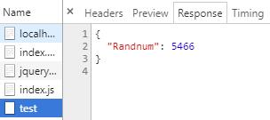
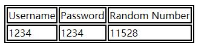
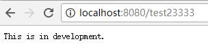
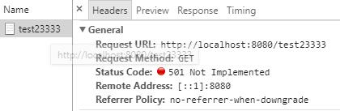

# cloudgo-io
cloudgo-io

---
## 需求

1. 支持静态文件服务
2. 支持简单 js 访问
3. 提交表单，并输出一个表格
4. 对 `/unknown` 给出开发中的提示，返回码 `5xx`

## 实现

1. 静态文件服务
```
    // let add the Request with prefix "/static" be sent to FileServer
    mx.PathPrefix("/static").Handler(http.StripPrefix("/static/", http.FileServer(http.Dir(webRoot+"/assets/"))))
```
  

2. 主页浏览器渲染前端显示  

  

3. 简单js访问  
  

  

4. 提交表单，并输出一个表格  
  

  
  
5. 对 `/unknown` 给出开发中的提示，返回码 `5xx`  
```
    //捕获其它所有没有绑定处理函数的url，统一返回开发中的提示
    mx.PathPrefix("/").HandlerFunc(inDevelopmentHandler)
```
  

